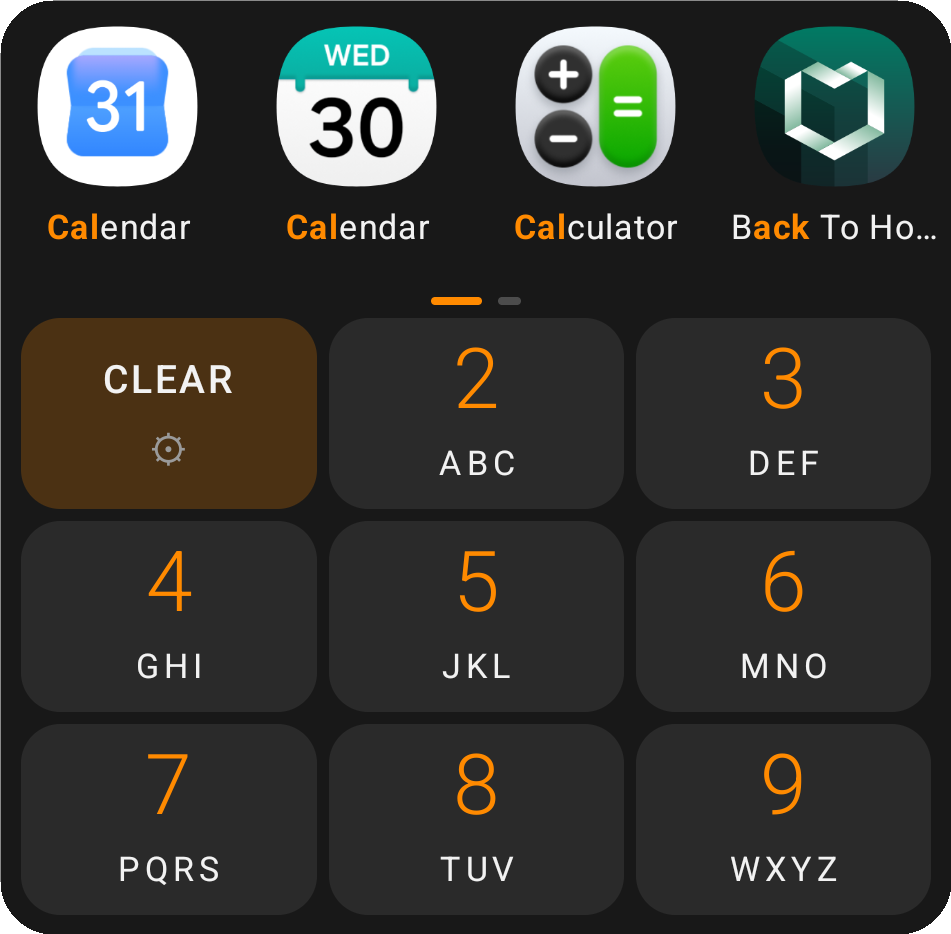
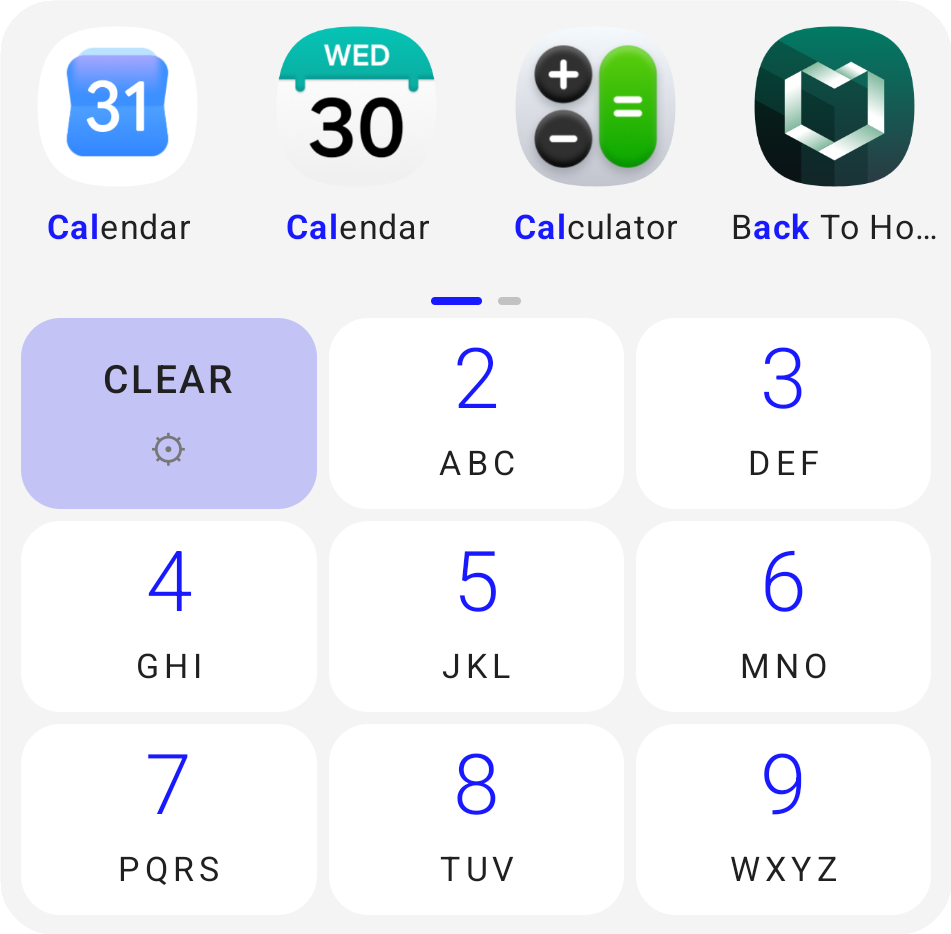
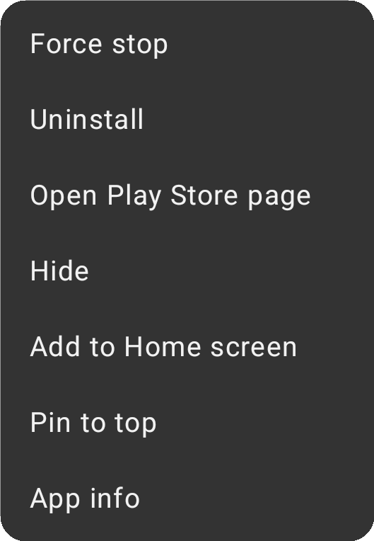
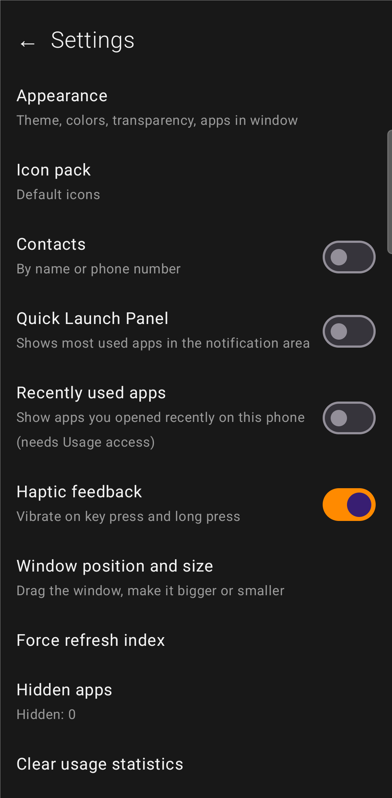
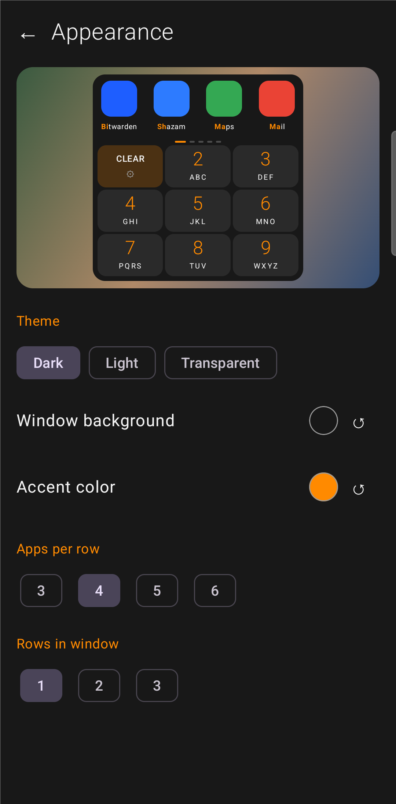
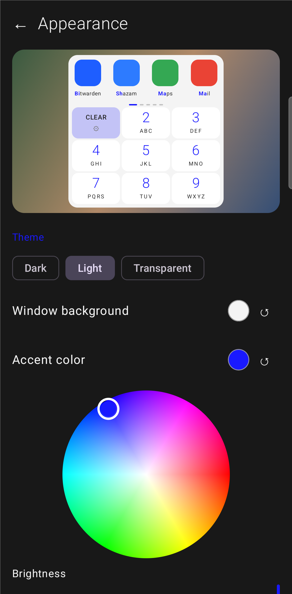

# A9

**A9** is a fast app-search pop-up for Android 16+ phones. It opens as a compact panel on top of whatever you are doing, lets you find and launch an app (or a contact) in a few taps, and offers the most useful actions when you long-press an icon.

The idea is simple: **a T9 keypad and the results at a glance** – no categories, no folders, no long scrolling through an app drawer. Everything runs locally on the phone: no internet, no account, no analytics.

<p align="center">
  
  &nbsp;&nbsp;
  
</p>

## Contents
- [Features](#features)
- [Screenshots](#screenshots)
- [How to use](#how-to-use)
- [How search works](#how-search-works)
- [Settings](#settings)
- [Permissions and privacy](#permissions-and-privacy)
- [Performance](#performance)
- [Architecture](#architecture)
- [Building](#building)
- [Tests](#tests)
- [Known limitations](#known-limitations)
- [License](#license)

## Features

**Search and results**
- T9 keypad (3×3): letters are searched through the digits 2–9, e.g. `225` → **Cal**endar, **Cal**culator.
- Matches the full name, individual words, `CamelCase` parts, initials (`gm` → Google Maps), the package name, and any substring of the name. Accented letters are treated as their base letters (`š` → `s`).
- Matched letters are **highlighted in the accent color** inside the app name – there is no query line, you simply see why an app showed up.
- Results are ranked by match quality and your usage history, and are paged – swipe sideways to see more.
- Empty query: **pinned** → **last launched via A9** → **recently used on the phone** (optional) → the rest alphabetically.
- Works with **work-profile** apps (marked 💼).
- Contact search (optional): by name or phone number.

**Long-press actions**
- App info, Pin / Unpin, Add to Home screen, Hide, Play Store page, Uninstall (non-system apps), Force stop (opens the system App info screen with its “Force stop” button).
- A compact menu opens above the icon (or below it) – **the most frequently used actions are closest to the icon**; A9 learns the order from how you use it.
- For contacts: call, SMS, open contact.

**More**
- **Quick Launch notification** with your 6 most-used apps (restored after a reboot).
- **Icon packs** (ADW / Nova / Go formats).
- **Appearance with a live preview**: theme (Dark / Light / Transparent), background color (color wheel + brightness) with transparency, accent color, number of apps in the window (3–6 columns × 1–3 rows).
- **Window position and size**: drag the window anywhere, make it bigger or smaller (the layout adapts).
- **Hidden apps** with search – hide any app or bring it back.
- Haptic feedback (can be turned off); English and Lithuanian UI.

## Screenshots

Screenshots are cropped to A9 itself (no phone wallpaper or other apps).

<table>
  <tr>
    <td align="center"><br><sub>Searching <code>225</code>: matched letters highlighted, CLEAR key (long-press for settings)</sub></td>
    <td align="center"><br><sub>Long-press: compact menu, the most-used action at the bottom – closest to the icon</sub></td>
  </tr>
  <tr>
    <td align="center"><br><sub>Light theme with a blue accent</sub></td>
    <td align="center"><br><sub>Settings</sub></td>
  </tr>
  <tr>
    <td align="center"><br><sub>Appearance: live preview, theme, colors, columns / rows</sub></td>
    <td align="center"><br><sub>Color wheel for the accent color + brightness slider</sub></td>
  </tr>
</table>

## How to use

| Action | Result |
|---|---|
| Launch A9 (launcher icon or another shortcut) | The panel opens; results show your recent apps |
| Type digits 2–9 | Results narrow down, matched letters are highlighted |
| Tap an icon | The app launches and A9 closes |
| Long-press an icon | Actions menu |
| **CLEAR** (tap) | Clears the whole query |
| **CLEAR** (long-press) | Opens settings |
| Swipe results sideways | More result pages |
| Tap outside the panel | Closes A9 |
| Back gesture | Clears the query first, then closes |

There are deliberately no “1” and “0” keys: T9 does not use them, so “1” is replaced by CLEAR / settings and the keypad stays compact.

## How search works

Search is pure Kotlin logic (`search/`) with no Android dependencies, so it is easy to test.

1. **Normalization** (`T9Map`): lowercase, no diacritics (`ą→a`, `ł→l`, `ß→s` …). T9 map: `2=abc 3=def 4=ghi 5=jkl 6=mno 7=pqrs 8=tuv 9=wxyz`.
2. **Searchable fragments** (`Tokenizer`) for each app / contact:
   - `FULL` – the whole name without spaces;
   - `WORD` – each word (including `CamelCase` parts);
   - `INITIALS` – the first letters of the words;
   - `PACKAGE` – parts of the package name;
   - `PHONE` – a contact's phone numbers.
3. **Query mode:** a query made only of digits is matched against a fragment's **T9 code**, otherwise against its text.
4. **Ranking** (`SearchEngine`): a base score by match type (full name > phone > word > initials > package > anywhere) plus prefix length; usage history is added on top (launch count capped at 50, recency over 30 days, pinned +5000). Ties are broken by name.
5. **Highlighting** (`Highlighter`): with the same priority, finds which characters of the name matched the query.

Search is a linear scan over an in-memory index (well under 1 ms for hundreds to thousands of entries).

## Settings

Open them by **long-pressing CLEAR**.

- **Appearance** – theme, background color and transparency, accent color, columns and rows, with a live preview at the top. Choosing a theme resets custom background settings.
- **Icon pack** – pick an installed icon pack or the default icons.
- **Contacts** – contact search (asks for READ_CONTACTS and CALL_PHONE).
- **Quick Launch Panel** – a persistent notification with your most-used apps (asks for notification permission).
- **Recently used apps** – show recently opened apps from the whole phone (opens the “Usage access” screen).
- **Haptic feedback** – vibration on key press / long-press.
- **Window position and size** – drag, resize, reset.
- **Force refresh index** – force a reload of the app and contact lists.
- **Hidden apps** – manage hidden apps (“Hidden” / “All apps” filters, search, “Show all”).
- **Clear usage statistics** – deletes A9's launch history (how many times / when each app was launched via A9). Pinned and hidden apps are untouched; “Recently used apps” uses the system history, so it does not change.

## Permissions and privacy

| Permission | Why | When |
|---|---|---|
| `QUERY_ALL_PACKAGES` | See all installed apps | always |
| `REQUEST_DELETE_PACKAGES` | Uninstall dialog | only when you tap Uninstall |
| `READ_CONTACTS` | Contact search | only when enabled |
| `CALL_PHONE` | Call directly (otherwise the dialer opens) | only with contacts enabled |
| `POST_NOTIFICATIONS` | Quick Launch notification | only when enabled |
| `RECEIVE_BOOT_COMPLETED` | Restore Quick Launch after a reboot | always |
| `PACKAGE_USAGE_STATS` | Recently used apps (Usage access) | only when enabled and granted |

**There is no internet permission.** No analytics, ads, accounts or cloud. Data is stored only in the app's private storage:
- settings – DataStore;
- usage statistics, pinned and hidden apps – `usage.json`;
- a copy of the app list – `apps_cache.json`;
- icon cache – `cache/icons/*.png`.

Because `QUERY_ALL_PACKAGES` does not fit Google Play policy for this purpose, A9 is meant to be installed directly (sideloaded).

## Performance

A cold start after a “force close” should show results immediately:
- the **app list** is saved to disk and read back within milliseconds after launch, while the `LauncherApps` list refines it in the background;
- **icons** are saved as PNG files and read from disk instead of being re-rendered by the system; the cache is invalidated when an app is updated;
- **settings** are read synchronously for the first frame so the theme does not jump;
- the list refreshes automatically (`LauncherApps.Callback`); updated apps get their icons reloaded individually, without flicker.

## Architecture

Kotlin 2.4, Jetpack Compose (Material 3), Gradle version catalog, AGP 9.4. `minSdk 29`, `targetSdk 36`, `compileSdk 37`. Package: `lt.tbu.a9`. Manual DI (a single `AppContainer`), no Hilt.

```
app/src/main/java/lt/tbu/a9/
  A9App.kt                 Application + AppContainer (all repositories)
  search/                  T9Map, Tokenizer, SearchEngine, Highlighter (pure logic + tests)
  data/                    AppRepository (LauncherApps), ContactRepository, RecentAppsRepository,
                           UsageRepository (JSON), SettingsRepository (DataStore), Models
  icons/                   IconLoader (memory + disk), IconPackManager (appfilter.xml)
  ui/                      DialerActivity, DialerScreen, DialerViewModel, keyboard/, results/,
                           actions/ (long-press menu), settings/ (settings, appearance, hidden apps), theme/
  notify/                  QuickLaunchNotifier, BootReceiver
  shortcut/                ShortcutTrampolineActivity (launching from a shortcut / notification)
```

Key decisions:
- **Window shape:** a translucent full-screen `Activity` in which Compose draws the panel; position and size use `BiasAlignment` plus a density scale, so everything scales uniformly.
- **Launching:** via `LauncherApps.startMainActivity` – works for work-profile apps as well.
- **Add to Home screen:** `ShortcutManagerCompat.requestPinShortcut` with `ShortcutTrampolineActivity`.
- **List updates:** `LauncherApps.Callback` instead of manifest `PACKAGE_*` broadcasts (no longer delivered since Android 8).

## Building

You need:
- **JDK 17+** (Android Studio bundles one).
- **Android SDK** with platform **37** and build-tools. The easiest way is to open the project in Android Studio (it creates `local.properties` and offers to download missing components). From the command line, set `ANDROID_HOME` (or create `local.properties` with `sdk.dir=…`) and accept the licenses (`sdkmanager --licenses`).
- Gradle downloads itself via the wrapper.

```
./gradlew testDebugUnitTest assembleDebug
```

APK: `app/build/outputs/apk/debug/app-debug.apk`. (If the project lives in a OneDrive folder, the build output is redirected to `%LOCALAPPDATA%\A9-build\app`, because OneDrive locks files.)

Install on a phone (USB debugging enabled):

```
adb install -r app-debug.apk
adb shell am start -n lt.tbu.a9/.ui.DialerActivity
```

### Release build and signing

`./gradlew assembleRelease` produces a shrunk (R8) APK at `app/build/outputs/apk/release/app-release.apk`.

Signing credentials are **never stored in the repository**. To sign with your own key, add these lines to your user-level `~/.gradle/gradle.properties`:

```
A9_STORE_FILE=/path/to/your-release.jks
A9_STORE_PASSWORD=...
A9_KEY_ALIAS=...
A9_KEY_PASSWORD=...
```

Without them the release build falls back to the debug key, so anyone can still build it. Keep your keystore and its passwords backed up: installed copies can only be updated by an APK signed with the same key.

## Tests

`./gradlew testDebugUnitTest` runs 21 unit tests (`search/`): T9 encoding, diacritics, tokenizing, ranking by usage and pinning, and highlight indices (prefix, word, initials, `CamelCase`, anywhere in the name).

## Known limitations

- **“Swipe up to Home” animation:** the window is a full-screen translucent one, so the system animation shrinks the whole window (the panel drifts toward the screen center). This is system behavior – the app cannot turn it off.
- **Native app shortcuts** (e.g. “New chat”) on long-press: Android only provides these to the default launcher, so A9 does not show them. App info is offered instead.
- **The real Recents list** is not available to third-party apps; “Recently used apps” uses the system usage history (Usage access) – very close, but not identical.
- **Force stop** cannot stop another app directly – the system App info screen opens with its “Force stop” button.

## License

GNU General Public License v3.0 – see [LICENSE](LICENSE).
